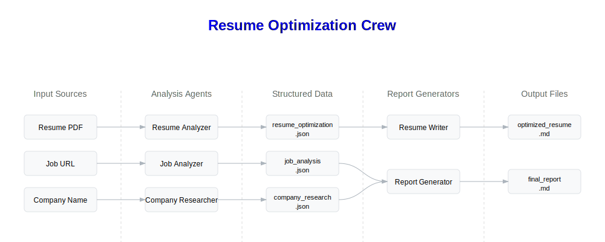

# Resume Optimization with CrewAI



An AI-powered tool that optimizes your resume for specific job applications using multiple AI agents. Built with [CrewAI](https://crewai.com).

## What It Does

1. **Job Analysis**: Analyzes job requirements, skills, and qualifications
2. **Resume Scoring**: Calculates match scores for technical skills, experience, and qualifications
3. **Optimization**: Suggests specific improvements to increase your match score
4. **Company Research**: Provides company insights for interview preparation

## System Components

### 1. Input Sources

- Resume (PDF format)
- Job URL
- Company Name

### 2. Analysis Agents

- **Job Analyzer**: Uses ScrapeWebsiteTool to analyze job descriptions
- **Resume Analyzer**: Uses PDFKnowledgeSource to analyze resumes
- **Company Researcher**: Uses SerperDevTool for company research

### 3. Structured Data

JSON files storing analysis results:

- job_analysis.json
- resume_optimization.json
- company_research.json

### 4. Report Generators

- **Resume Writer**: Creates optimized resumes
- **Report Generator**: Creates comprehensive reports

### 5. Output Files

Markdown files:

- optimized_resume.md
- final_report.md

## Architecture 
```
🚀 Crew: Resume Optimization
├── 📋 Task: 81123e97-3c4d-4070-8481-2b5faf068fc6
│      Assigned to: Job Requirements Analyst
│      Status: ✅ Completed
│   └── 🤖 Agent: Job Requirements Analyst
│           Status: ✅ Completed
│       └── 🔧 Used Read website content (1)
├── 📋 Task: b9e31aed-4749-4f78-9a30-ab4df0f5e3f9
│      Assigned to: Resume Optimization Expert
│      Status: ✅ Completed
│   └── 🤖 Agent: Resume Optimization Expert
│           Status: ✅ Completed
├── 📋 Task: 18a5378e-abb4-4bc3-a8cb-715555dcc4d3
│      Assigned to: Company Intelligence Specialist
│      Status: ✅ Completed
│   └── 🤖 Agent: Company Intelligence Specialist
│           Status: ✅ Completed
│       └── 🔧 Used Search the internet with Serper
├── 📋 Task: 0a173a87-7877-4823-a164-928fd4d2e060
│      Assigned to: Resume Markdown Specialist
│      Status: ✅ Completed
│   └── 🤖 Agent: Resume Markdown Specialist
│           Status: ✅ Completed
├── 📋 Task: d2181ec2-6882-4761-99ca-76e168371000
│      Assigned to: Career Report Generator and Markdown Specialist
│      Status: ✅ Completed
│   └── 🤖 Agent: Career Report Generator and Markdown Specialist
│           Status: ✅ Completed
└── 📋 Task: 6a8598ec-d30b-4770-9ed5-4cc772847425
       Assigned to: Career Report Generator and PDF Formatting Specialist
       Status: ✅ Completed
    └── 🤖 Agent: Career Report Generator and PDF Formatting Specialist
            Status: ✅ Completed
```

## Installation

1. Clone the repository and install dependencies:

    ```bash
    git clone https://github.com/naveenkrishnan840/resume-optimization-crewai.git
    cd resume-optimization-crew
    ```

2. Create a virtual environment and install dependencies:
    ```bash
    python3 -m venv .venv
    source .venv/bin/active
    crewai install
    ```

## Environment Setup

1. Copy `.env.example` to `.env`:
    ```bash
    cp .env.example .env
    ```

2. Add your API keys to `.env`:
    - Required:
        - `GOOGLE_API_KEY`: OpenAI API key
        - `SERPER_API_KEY`: Serper API key for web search
    - Optional:
        - See `.env.example` for additional optional APIs

## Quick Start

1. Save your resume as PDF in the project root under the `knowledge/` directory:
    - Feel free to use the sample resume provided in `knowledge/knowledge/CV_Mohan.pdf`
    - I got it from [here](https://www.hbs.edu/doctoral/Documents/job-market/CV_Mohan.pdf)

2. Fill in the input data in `main.py`:
    - `job_url`: URL of the job posting (e.g., 'https://www.mckinsey.com/careers/search-jobs/jobs/associate-15178')
    - `company_name`: Name of the company (e.g., 'Mckinsey & Co.')

3. Run the optimization crew:
    ```bash
    crewai run
    ```

## Output Files

The tool generates three JSON files in the `output` directory:

- `job_analysis.json`: Detailed job requirements and match scoring
- `resume_optimization.json`: Specific suggestions to improve your resume
- `company_research.json`: Company insights for interview prep

## Architecture

The system uses three specialized AI agents:

1. **Job Analyzer**: Extracts and analyzes job requirements
2. **Resume Analyzer**: Scores resume match and suggests improvements
3. **Company Researcher**: Gathers company information for interviews

## Requirements

- Python `>= 3.10` and `< 3.13`
- PDF resume file
- Job posting URL
- Company name

## Support

- [CrewAI Documentation](https://docs.crewai.com)
- [Community Forum](https://community.crewai.com)
- [Chat with our docs](https://chatg.pt/DWjSBZn)
